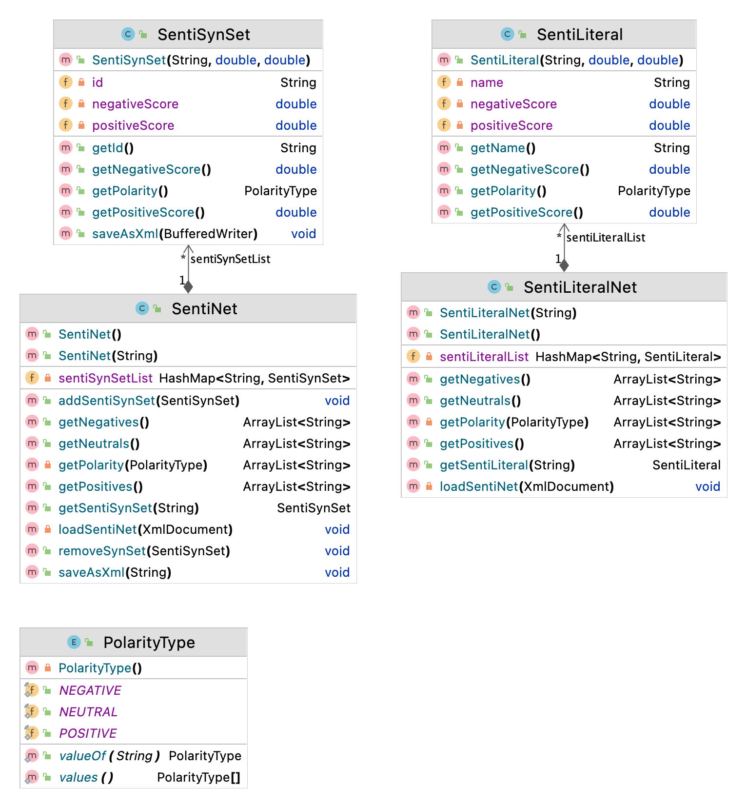

Turkish Sentiment Lexicon (HisNet)
============

# Polarity Lexicons

Exploiting a dictionary-based method necessitates the construction of a specific polarity dictionary in the same language as the data-to-be-analyzed. The reason behind this necessity stems from the improbability of creating a universal polarity dictionary due to both grammatical and cultural asymmetries between languages. For instance, a certain historical event can have positive connotations in one culture and negative connotations in another culture. Thus, it is an essential step to create a language specific polarity dictionary.

The first examples of polarity dictionary work could be found in English. SentiWordNet 1.0, the very first study on English polarity dictionaries, was presented by Esuli and Sebastiani (2006). Considerable research has been conducted to improve these resources with the aim of making them more precise. For example, the polarities of the objective words in SentiWordNet have been reassessed by Hung and Lini (2010). SenticNet (Cambria et al., 2014), another well-known dictionary in English, is created by rescoring words based on five different criteria, which are happiness, attention, sensitivity, ability and general polarity. Thus, it is evident that SenticNet is a polarity dictionary that provides a more extensive emotional evaluation than SentiWordNet.

There are polar dictionaries created in major languages other than English. However, these dictionaries were found to be insufficient in terms of the number of words. Brooke et al. (2009) aimed to translate English polarity sources to Spanish. At first, the methods established independent from the target language were found adequate, yet in the long term it was noticed that these methods were costly and inaccurate. Employing language-dependent resources to improve this system was deemed more feasible. Remus et al. (2010) have created a German sensitivity dictionary named SentiWortschatz for the German language. For the purpose of creating a feeling dictionary, over 3500 German words were assigned positive and nega- tive values in the range of [-1, 1], using PosTags. Abdaoui et al. (2017) have created the FEEL: a French Expanded Emotion Lexicon polarity dictionary for French. Moreno-Sandoval et al. (2017) have created the Combined Spanish Lexicon polarity dictionary for Spanish.

# Turkish Polarity Lexicon HisNet

In this study, we present a polarity dictionary to provide an extensive polarity dictionary for Turkish that dictionary-based sentiment analysis studies have been longing for. Our primary objective is to provide a more refined and extensive polarity dictionary than the previous SentiTurkNet. In doing so, we have resorted to a different network from the referenced study. We have identified approximately 76,825 synsets from Kenet, which then were manually labeled as positive, negative or neutral by three native speakers of Turkish. The first labelling process resulted in 3,100 positive, 10,191 negative and 63,534 neutral data, during which decisions were based on the meaning and connotation of each word. 

Subsequently, a second labeling was further made on positive and negative words as strong or weak based on their degree of positivity or negativity. For instance, the word mükemmel (excellent) in Turkish has been marked three times. Thus, three different views were obtained for the value of this word. While selecting the appropriate label, the compatibility of the labels selected by the three labelers was also evaluated. To put it differently, if a positive word receives strong label from all three annotators, it is regarded as strong positive. If it receives two strong and one weak label, it is considered as very positive. If it is la- belled as strong once and as weak twice, it means it is just positive. Finally, if it receives weak label from all three annotators, it is considered as weak positive. The same is also true for the words labelled as negative.

|Polarity Level|# of Synsets|
|---|---|
|Strongly positive|1,038|
|Very positive|451|
|Positive|456|
|Weakly positive|1,234|
|Objective|63,534|
|Strongly negative|4,430|
|Very negative|1,465|
|Negative|1,238|
|Weakly negative|3,360|

Video Lectures
============

[](https://youtu.be/CdHSwgq2lTE)[](https://youtu.be/_tbrvPlG87Y)[](https://youtu.be/CUbNz34Ac5c)

Class Diagram
============



For Developers
============

You can also see [Python](https://github.com/starlangsoftware/TurkishSentiNet-Py), [Cython](https://github.com/starlangsoftware/TurkishSentiNet-Cy), [C](https://github.com/starlangsoftware/TurkishSentiNet-C), [C++](https://github.com/starlangsoftware/TurkishSentiNet-CPP), [Swift](https://github.com/starlangsoftware/TurkishSentiNet-Swift), [Js](https://github.com/starlangsoftware/TurkishSentiNet-Js), [Php](https://github.com/starlangsoftware/TurkishSentiNet-Php), or [C#](https://github.com/starlangsoftware/TurkishSentiNet-CS) repository.

## Requirements

* [Java Development Kit 8 or higher](#java), Open JDK or Oracle JDK
* [Maven](#maven)
* [Git](#git)

### Java 

To check if you have a compatible version of Java installed, use the following command:

    java -version
    
If you don't have a compatible version, you can download either [Oracle JDK](https://www.oracle.com/technetwork/java/javase/downloads/jdk8-downloads-2133151.html) or [OpenJDK](https://openjdk.java.net/install/)    

### Maven
To check if you have Maven installed, use the following command:

    mvn --version
    
To install Maven, you can follow the instructions [here](https://maven.apache.org/install.html).      

### Git

Install the [latest version of Git](https://git-scm.com/book/en/v2/Getting-Started-Installing-Git).

## Download Code

In order to work on code, create a fork from GitHub page. 
Use Git for cloning the code to your local or below line for Ubuntu:

	git clone <your-fork-git-link>

A directory called SentiNet.SentiNet will be created. Or you can use below link for exploring the code:

	git clone https://github.com/olcaytaner/SentiNet.SentiNet.git

## Open project with IntelliJ IDEA

Steps for opening the cloned project:

* Start IDE
* Select **File | Open** from main menu
* Choose `SentiNet.SentiNet/pom.xml` file
* Select open as project option
* Couple of seconds, dependencies with Maven will be downloaded. 


## Compile

**From IDE**

After being done with the downloading and Maven indexing, select **Build Project** option from **Build** menu. After compilation process, user can run SentiNet.SentiNet.

**From Console**

Go to `SentiNet.SentiNet` directory and compile with 

     mvn compile 

## Generating jar files

**From IDE**

Use `package` of 'Lifecycle' from maven window on the right and from `SentiNet.SentiNet` root module.

**From Console**

Use below line to generate jar file:

     mvn install

## Maven Usage

        <dependency>
            <groupId>io.github.starlangsoftware</groupId>
            <artifactId>SentiNet</artifactId>
            <version>1.0.8</version>
        </dependency>

Detailed Description
============

+ [SentiNet](#sentinet)
+ [SentiSynSet](#sentisynset)

## SentiNet

Duygu sözlüğünü yüklemek için

	a = SentiNet()

Belirli bir alana ait duygu sözlüğünü yüklemek için

	SentiNet(String fileName)
	a = SentiNet("dosya.txt")

Belirli bir synsete ait duygu synsetini elde etmek için

	SentiSynSet getSentiSynSet(String id)

## SentiSynSet

Bir SentiSynset elimizdeyken onun pozitif skorunu

	double getPositiveScore()

negatif skorunu

	double getNegativeScore()

polaritysini

	PolarityType getPolarity()

# Cite

	@inproceedings{ozcelik21,
 	title={{H}is{N}et: {A} {P}olarity {L}exicon based on {W}ord{N}et for {E}motion {A}nalysis},
 	year={2021},
 	author={M. Ozcelik and B. N. Arican and O. Bakay and E. Sarmis and N. B. Bayazit and O. Ergelen and O. T. Y{\i}ld{\i}z},
 	booktitle={Proceedings of GWC 2021}
 	}
	
For Contibutors
============

### pom.xml file
1. Standard setup for packaging is similar to:
```
    <groupId>io.github.starlangsoftware</groupId>
    <artifactId>Amr</artifactId>
    <version>1.0.0</version>
    <packaging>jar</packaging>
    <name>NlpToolkit.Amr</name>
    <description>Abstract Meaning Representation Library</description>
    <url>https://github.com/StarlangSoftware/Amr</url>

    <organization>
        <name>io.github.starlangsoftware</name>
        <url>https://github.com/starlangsoftware</url>
    </organization>

    <licenses>
        <license>
            <name>The Apache Software License, Version 2.0</name>
            <url>http://www.apache.org/licenses/LICENSE-2.0.txt</url>
        </license>
    </licenses>

    <developers>
        <developer>
            <name>Olcay Taner Yildiz</name>
            <email>olcay.yildiz@ozyegin.edu.tr</email>
            <organization>Starlang Software</organization>
            <organizationUrl>http://www.starlangyazilim.com</organizationUrl>
        </developer>
    </developers>

    <scm>
        <connection>scm:git:git://github.com/starlangsoftware/amr.git</connection>
        <developerConnection>scm:git:ssh://github.com:starlangsoftware/amr.git</developerConnection>
        <url>http://github.com/starlangsoftware/amr/tree/master</url>
    </scm>

    <properties>
        <maven.compiler.source>1.8</maven.compiler.source>
        <maven.compiler.target>1.8</maven.compiler.target>
        <project.build.sourceEncoding>UTF-8</project.build.sourceEncoding>
    </properties>
```
2. Only top level dependencies should be added. Do not forget junit dependency.
```
    <dependencies>
        <dependency>
            <groupId>io.github.starlangsoftware</groupId>
            <artifactId>AnnotatedSentence</artifactId>
            <version>1.0.78</version>
        </dependency>
        <dependency>
            <groupId>junit</groupId>
            <artifactId>junit</artifactId>
            <version>4.13.1</version>
            <scope>test</scope>
        </dependency>
    </dependencies>
```
3. Maven compiler, gpg, source, javadoc plugings should be added.
```
	<plugin>
		<groupId>org.apache.maven.plugins</groupId>
		<artifactId>maven-compiler-plugin</artifactId>
		<version>3.6.1</version>
		<configuration>
			<source>1.8</source>
			<target>1.8</target>
		</configuration>
	</plugin>
	<plugin>
		<groupId>org.apache.maven.plugins</groupId>
		<artifactId>maven-gpg-plugin</artifactId>
		<version>1.6</version>
		<executions>
			<execution>
				<id>sign-artifacts</id>
				<phase>verify</phase>
				<goals>
					<goal>sign</goal>
				</goals>
			</execution>
		</executions>
	</plugin>
	<plugin>
		<groupId>org.apache.maven.plugins</groupId>
		<artifactId>maven-source-plugin</artifactId>
		<version>2.2.1</version>
		<executions>
			<execution>
				<id>attach-sources</id>
				<goals>
					<goal>jar-no-fork</goal>
				</goals>
			</execution>
		</executions>
	</plugin>
	<plugin>
		<groupId>org.apache.maven.plugins</groupId>
		<artifactId>maven-javadoc-plugin</artifactId>
		<configuration>
			<source>8</source>
		</configuration>
		<version>3.10.0</version>
		<executions>
			<execution>
				<id>attach-javadocs</id>
				<goals>
					<goal>jar</goal>
				</goals>
			</execution>
		</executions>
	</plugin>
```
4. Currently publishing plugin is Sonatype.
```
	<plugin>
		<groupId>org.sonatype.central</groupId>
		<artifactId>central-publishing-maven-plugin</artifactId>
		<version>0.8.0</version>
		<extensions>true</extensions>
		<configuration>
			<publishingServerId>central</publishingServerId>
			<autoPublish>true</autoPublish>
		</configuration>
	</plugin>
```
5. For UI jar files use assembly plugins.
```
	<plugin>
		<groupId>org.apache.maven.plugins</groupId>
		<artifactId>maven-assembly-plugin</artifactId>
		<version>2.2-beta-5</version>
		<executions>
			<execution>
				<id>sentence-dependency</id>
				<phase>package</phase>
				<goals>
					<goal>single</goal>
				</goals>
				<configuration>
					<archive>
						<manifest>
							<mainClass>Amr.Annotation.TestAmrFrame</mainClass>
						</manifest>
					</archive>
					<finalName>amr</finalName>
				</configuration>
			</execution>
		</executions>
		<configuration>
			<descriptorRefs>
				<descriptorRef>jar-with-dependencies</descriptorRef>
			</descriptorRefs>
			<appendAssemblyId>false</appendAssemblyId>
		</configuration>
	</plugin>
```
### Resources
1. Add resources to the resources subdirectory. These will include image files (necessary for UI), data files, etc.
   
### Java files
1. Do not forget to comment each function.
```
    /**
     * Returns the value of a given layer.
     * @param viewLayerType Layer for which the value questioned.
     * @return The value of the given layer.
     */
    public String getLayerInfo(ViewLayerType viewLayerType){
```
2. Function names should follow caml case.
```
    public MorphologicalParse getParse()
```
3. Write toString methods, if necessary.
4. Use Junit for writing test classes. Use test setup if necessary.
```
public class AnnotatedSentenceTest {
    AnnotatedSentence sentence0, sentence1, sentence2, sentence3, sentence4;
    AnnotatedSentence sentence5, sentence6, sentence7, sentence8, sentence9;

    @Before
    public void setUp() throws Exception {
        sentence0 = new AnnotatedSentence(new File("sentences/0000.dev"));
```
